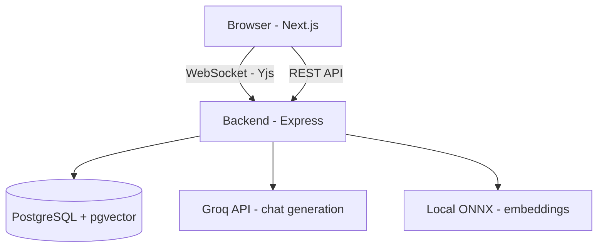

# SyncForge — AI-Powered Collaborative Workspace


A real-time collaborative document editor with AI built in — not a Google Docs clone, but a workspace where documents, live collaboration, and AI assistance are one connected system.

## What this is

SyncForge lets teams write documents together in real time, with live cursors and no merge conflicts (thanks to CRDT-based sync via Yjs), and layers AI directly on top: chat with your document, extract action items, generate diagrams from content, and roll back to earlier versions — all running on a completely free stack (Groq's Llama 3.3 70B + a locally-run embedding model, no paid API keys required).

## Features

**Core**

- JWT authentication, workspaces, and role-based permissions (Owner / Editor / Viewer)
- Real-time collaborative editing (Yjs CRDT + TipTap), with live named cursors per user
- Presence indicators (who's online, who's typing)
- Version history with save/restore, live-applied through the active collaborative session
- Debounced autosave

**AI (Groq + local embeddings — zero-cost inference)**

- Chat with your document (RAG: chunking → local embeddings via Xenova/all-MiniLM-L6-v2 → pgvector similarity search → Groq-generated, grounded answers)
- Action-item extraction (structured JSON → interactive checklist)
- AI-generated Mermaid diagrams from document content

## Tech stack

| Layer     | Tech                                                                     |
| --------- | ------------------------------------------------------------------------ |
| Frontend  | Next.js (App Router), TypeScript, Tailwind CSS, TipTap                   |
| Backend   | Node.js, Express, Prisma, PostgreSQL + pgvector                          |
| Real-time | Yjs, y-websocket, Socket.IO (presence)                                   |
| AI        | Groq API (Llama 3.3 70B), local Xenova embeddings (ONNX, runs on-device) |
| Infra     | Docker Compose (Postgres + Redis), GitHub Actions CI                     |

## Architecture



## Getting started

**Prerequisites:** Node.js 18+, Docker Desktop, a free [Groq API key](https://console.groq.com)

1. **Start Postgres + Redis:**

```bash
docker compose up -d
```

2. **Enable pgvector:**

```bash
docker compose exec postgres psql -U workspace -d ai_workspace -c "CREATE EXTENSION IF NOT EXISTS vector;"
```

3. **Backend:**

```bash
cd backend
cp .env.example .env    # set JWT_SECRET and GROQ_API_KEY
npm install
npx prisma migrate dev
npm run dev              # http://localhost:4000
```

4. **Frontend:**

```bash
cd frontend
cp .env.local.example .env.local
npm install
npm run dev               # http://localhost:3000
```

5. Sign up, create a document, and start typing. Open the same document in a second browser (or incognito window, signed in as a different user) to see live collaboration in action.

## Known limitations

Being upfront about these rather than glossing over them:

- **Version restore and open sessions:** restoring a version force-applies the change through the live Yjs document, so it now updates in real time for anyone with the document open — this required bypassing the normal "only seed if empty" safety check that protects against accidentally overwriting concurrent edits in other scenarios.
- **In-memory Yjs state:** the WebSocket server holds each document's live state in memory. A server restart mid-session relies on Postgres snapshots (saved every 5 seconds) for recovery — any edits within that window since the last snapshot aren't recoverable.
- **Chunking is character-based, not semantic** — a production RAG system would chunk on paragraph/semantic boundaries with a real tokenizer.
- **LLM-structured output (action items, diagrams) isn't always perfectly formed** on the first attempt — occasional retries may be needed, a known characteristic of LLM JSON/DSL generation rather than a bug in this implementation.

## Why these technical choices

- **Yjs over building custom operational transform:** CRDT conflict resolution is significantly harder to get right by hand than to adopt from a mature library — this was a deliberate scope decision, not a shortcut.
- **Groq + local embeddings over OpenAI:** zero ongoing cost, and a legitimately interesting architecture to discuss — fast cloud inference for generation, on-device inference for embeddings, each chosen for what it's actually good at.
- **Express over NestJS:** matched the stack to prior experience rather than adding a new framework's learning curve on top of CRDT and RAG complexity simultaneously.

## Roadmap (not yet built)

- Comments (anchored to text selections)
- Notifications
- Deployment (in progress)
